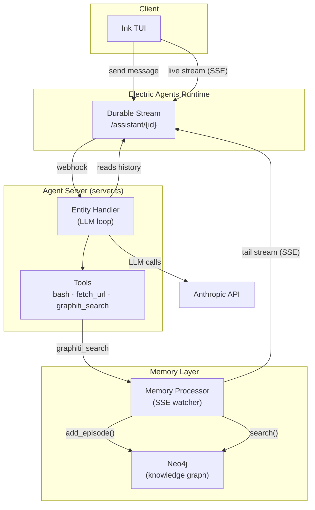

# electric-graphiti

**Durable agent streams + temporal knowledge graph memory.**

[Electric Agents](https://electric.ax/agents) gives every agent a persistent, addressable event stream — sessions survive restarts and can be resumed from any machine. [Graphiti](https://github.com/getzep/graphiti) turns that stream history into a temporal knowledge graph: entities, relationships, and facts extracted from conversation and stored in Neo4j, queryable across sessions.

The result: agents that remember — not just within a session, but across sessions, across restarts, across machines.

## Why

Most agent frameworks give you ephemeral memory. When the session ends, the agent forgets. The common workarounds fall short:

- **Vector search** — no entity resolution, no temporal tracking, no relationship traversal
- **Raw session history** — full fidelity, but hits token limits fast and can't be queried
- **Managed agent sessions** — no cross-session memory, sessions aren't pluggable

Electric solves addressability. Graphiti solves structure. Together they cover what neither does alone.

## How it works



- **Every conversation** is a durable Electric stream — append-only, replayable, addressable by URL
- **Every turn** is ingested by the memory processor: entities and relationships extracted by Graphiti, stored in Neo4j
- **On each new turn**, the agent can call `graphiti_search` to retrieve relevant facts from any previous session
- **Context window**: recent turns verbatim + on-demand graph retrieval for older facts — Graphiti is the compaction layer

## Stack

| Component | Role |
|-----------|------|
| [Electric Agents](https://electric.ax/agents) | Durable agent runtime, entity registry, webhook dispatch |
| [Graphiti](https://github.com/getzep/graphiti) | Temporal KG — entity extraction, fact tracking, graph search |
| [Neo4j](https://neo4j.com) | Graph database backing Graphiti |
| Claude (haiku / sonnet) | LLM for entity extraction + agent responses |
| fastembed | Local ONNX embeddings — no OpenAI dependency |
| Ink (React) | Terminal UI — current default UI |

## Running locally

**Prerequisites:** Docker, Node.js 22+, an Anthropic API key.

```bash
git clone https://github.com/nharsch/electric-graphiti
cd electric-graphiti
cp .env.example .env  # add your ANTHROPIC_API_KEY
docker compose up -d
npm install
```

Everything runs in Docker: Electric Agents runtime, Neo4j, memory processor, and agent server. The server uses `network_mode: host` to receive webhook callbacks from the Electric Agents container.

Open the TUI:

```bash
npx tsx tui.tsx
```

Pick a session or create one, start chatting. Memory is persisted to Neo4j automatically. Open a second session — the agent will recall facts from the first.

**Ports:**
- `4437` — Electric Agents runtime
- `3000` — Agent server (webhook endpoint)
- `7001` — Graphiti search API
- `7474` / `7687` — Neo4j browser / Bolt

## Repo layout

```
server.ts            — entity registry, LLM loop, graphiti_search tool
tui.tsx              — Ink TUI (session picker, live stream, send)
memory_processor.py  — SSE watcher → Graphiti ingest + search HTTP server
docker-compose.yml   — full stack
Dockerfile           — memory-processor image
Dockerfile.server    — agent server image
```

## What's next

- [ ] VPS deploy — session pickup across machines
- [ ] Web UI — Vite + React, shared core with TUI, proxied through server.ts
- [ ] `#remember` directives — operational memory as first-class stream events, injected into system prompt

## Related

- [Electric Agents](https://electric.ax/agents)
- [Electric Deep Survey demo](https://electric.ax/agents/demos/deep-survey) — multi-agent KG that inspired this; disappears on session end
- [Graphiti](https://github.com/getzep/graphiti) / [paper](https://arxiv.org/abs/2501.13956)
- [ActiveGraph](https://activegraph.ai) / [paper](https://arxiv.org/abs/2605.21997) — closest prior work; log-primary reactive graph agents
