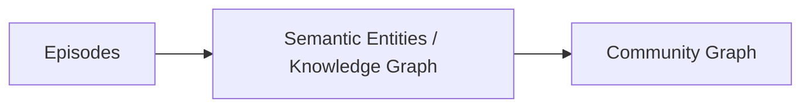
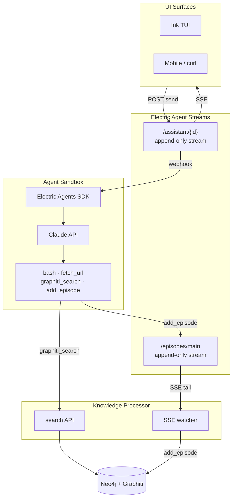

# electric-graphiti

**Durable agent streams + temporal knowledge graph memory.**

[Electric Agents](https://electric.ax/agents) gives every agent a persistent, addressable event stream — sessions survive restarts and can be resumed from any machine. [Graphiti](https://github.com/getzep/graphiti) turns that stream history into a temporal knowledge graph: entities, relationships, and facts extracted from conversation and stored in Neo4j, queryable across sessions.

The result: agents that remember — not just within a session, but across sessions, across restarts, across machines.

## Why

I fully subscribe to the core claim of Electric Agents:

> Agents are not compute. Agents are data. Multi-agent is a sync problem.
- [Electric](https://electric.ax/blog/2026/04/29/introducing-electric-agents)

This project investigates how a multi-agent knowledge store could work on top of an Agent Stream graph.

Zep's [Graphiti](https://github.com/getzep/graphiti) takes a very "stream processing" appraoch to building a Knowledge Graph, where **Episodes** map to a stream of incoming knowledge events, and the **Semantic Entity Graph** and **Communicty Graph** are views on that stream:



## How it works



- **Every conversation** is a durable Electric stream — append-only, replayable, addressable by URL
- **Agents write their own episodes** via the `add_episode` tool when they detect a fact, learned preference, or receive a document for ingestion
- **The episodes stream** (`/episodes/main`) is an inert, durable log — the observable record of everything submitted for KG ingestion
- **The knowledge processor** tails the episodes stream via SSE, tracks its own offset, and calls `graphiti.add_episode()` per event
- **On each turn**, the agent can call `graphiti_search` to retrieve relevant facts from any previous session

## Architectural decisions

### Episodes as an agent stream

Graphiti's core ingestion artifact is the [episode](https://help.getzep.com/graphiti/graphiti/concepts) — a unit of interaction from which entities and facts are extracted. Rather than passively inferring episodes from raw message pairs, agents here write episodes explicitly via an `add_episode` tool call, using Graphiti's own episode types as a guide:

- `fact_triple` — an explicit factual assertion the agent has identified ("Nigel writes Clojure")
- `text` — an unstructured document or corpus handed to the agent for ingestion
- `json` — structured data

These episodes are written to `/episodes/main` — a first-class Electric entity stream.

The agent is the router: it classifies what kind of memory operation is needed and dispatches accordingly. Graphiti's haiku extraction step handles the rest.

## Stack

| Component | Role |
|-----------|------|
| [Electric Agents](https://electric.ax/agents) | Durable agent runtime, entity registry, webhook dispatch |
| [Graphiti](https://github.com/getzep/graphiti) | Temporal KG — entity extraction, fact tracking, graph search |
| [Neo4j](https://neo4j.com) | Graph database backing Graphiti |
| Claude (haiku / sonnet) | LLM for entity extraction + agent responses |
| fastembed | Local ONNX embeddings — no OpenAI dependency |
| Ink (React) | Terminal UI — current default UI |

## Running locally

**Prerequisites:** Docker, Node.js 22+, an Anthropic API key.

```bash
git clone https://github.com/nharsch/electric-graphiti
cd electric-graphiti
cp .env.example .env  # add your ANTHROPIC_API_KEY
docker compose up -d
```

Everything runs in Docker: Electric Agents runtime, Neo4j, memory processor, and agent server. The server uses `network_mode: host` to receive webhook callbacks from the Electric Agents container.

Pick a session or create one, start chatting. Memory is persisted to Neo4j automatically. Open a second session — the agent will recall facts from the first.

**Ports:**
- `4437` — Electric Agents runtime
- `3000` — Agent server (webhook endpoint)
- `7001` — Graphiti search API
- `7474` / `7687` — Neo4j browser / Bolt

## Repo layout

```
server.ts            — entity registry, LLM loop, add_episode + graphiti_search tools
tui.tsx              — Ink TUI (session picker, live stream, send)
memory_processor.py  — knowledge processor: SSE tail of /episodes/main → Graphiti + search API
docker-compose.yml   — full stack
Dockerfile           — knowledge-processor image
Dockerfile.server    — agent server image
```

## Related

- [Electric Agents](https://electric.ax/agents)
- [Electric Deep Survey demo](https://electric.ax/agents/demos/deep-survey) — multi-agent KG that inspired this; disappears on session end
- [Graphiti](https://github.com/getzep/graphiti) / [paper](https://arxiv.org/abs/2501.13956)
- [ActiveGraph](https://activegraph.ai) / [paper](https://arxiv.org/abs/2605.21997) — closest prior work; log-primary reactive graph agents
